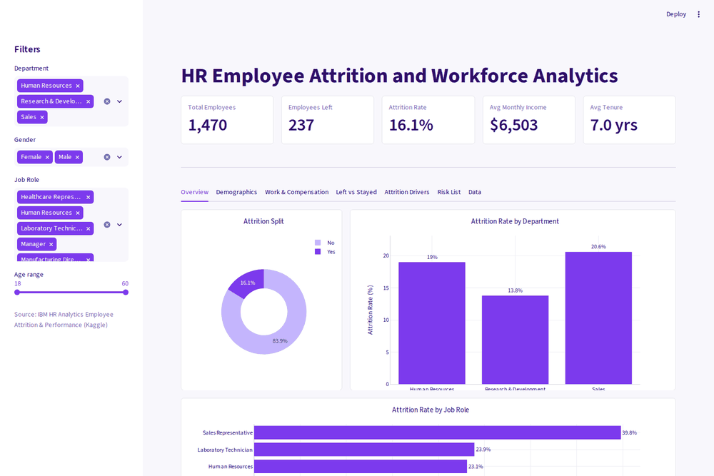
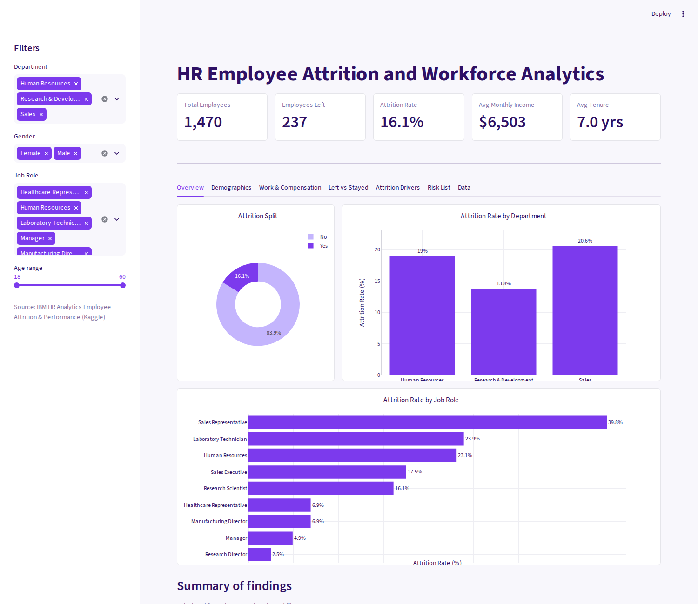
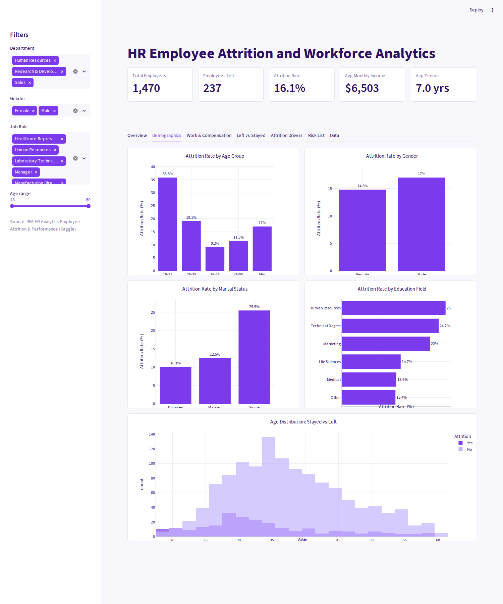
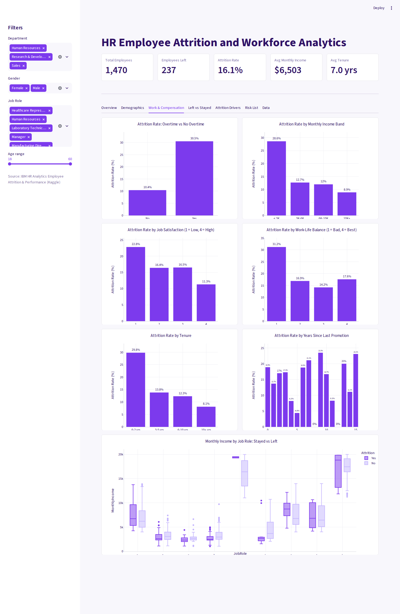
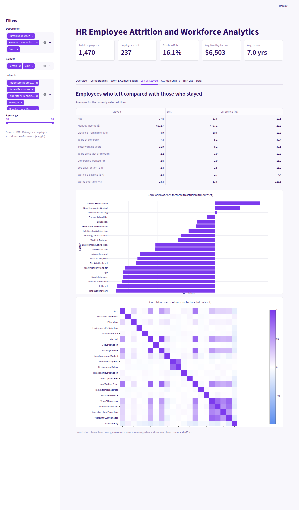
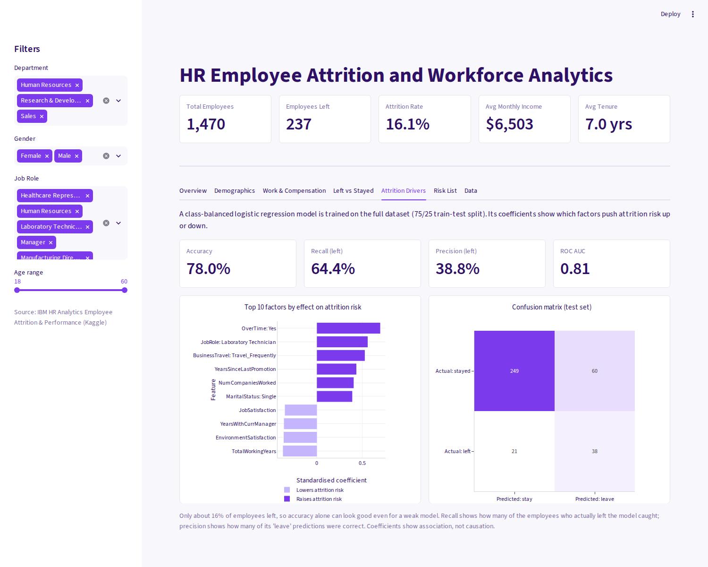
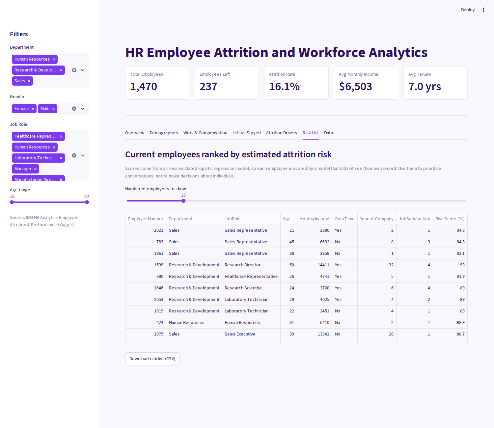

# HR Employee Attrition and Workforce Analytics Dashboard

An interactive dashboard that shows who is leaving a company, which factors are linked to attrition, and where HR should focus retention efforts. Built with Python, Streamlit and Plotly on the IBM HR Analytics dataset.

**Live demo:** https://hr-employee-attrition-and-workforce-analytics-dashboard-dirquy.streamlit.app/



## Problem statement
Employee attrition is costly: hiring, onboarding and lost productivity all add up. HR needs to know which groups of employees are most likely to leave and what factors are associated with it, so retention effort can be targeted instead of guessed.

## Dataset
- **Source:** [IBM HR Analytics Employee Attrition & Performance](https://www.kaggle.com/datasets/pavansubhasht/ibm-hr-analytics-attrition-dataset) (Kaggle)
- **Size:** 1,470 employees, 35 columns. No missing values.
- **Target:** `Attrition` (Yes / No). 237 employees (16.1%) left.
- The dataset is fictional, created by IBM data scientists for analytics practice. A copy is included in `data/` so the project runs straight after cloning.

## Approach
1. **Cleaning:** checked missing values and duplicates; removed columns that carry no information (`EmployeeCount`, `StandardHours`, `Over18`) and the row identifier (`EmployeeNumber`, kept only as an ID in the risk list).
2. **Feature engineering:** created `AgeGroup`, `IncomeBand`, `TenureBand` and a numeric `AttritionFlag`.
3. **Exploratory analysis:** attrition rate across departments, job roles, demographics, pay, overtime, satisfaction and tenure.
4. **Dashboard:** KPI cards, sidebar filters and seven tabs.
5. **Model:** a class-balanced logistic regression (standardised features, 75/25 stratified split). It was chosen over a random forest because it caught far more of the employees who left (recall 64% versus 17% in testing) and its coefficients show the direction of each effect.

## Dashboard tabs
| Tab | What it shows |
|---|---|
| Overview | KPI cards, attrition split, rate by department and job role, summary of findings |
| Demographics | Age group, gender, marital status, education field, age distribution |
| Work & Compensation | Overtime, income band, job satisfaction, work-life balance, tenure, promotion gap |
| Left vs Stayed | Side-by-side averages, correlation with attrition, correlation matrix |
| Attrition Drivers | Top 10 factors, accuracy / recall / precision / ROC AUC, confusion matrix |
| Risk List | Current employees ranked by cross-validated attrition risk, with CSV download |
| Data | Column guide, filtered data table, CSV download |

Filters (department, gender, job role, age) apply across the dashboard.

## Screenshots
| | |
|---|---|
|  |  |
|  |  |
|  |  |

## Key findings
- **Overall attrition is 16.1%** (237 of 1,470 employees).
- **Overtime is the clearest signal:** 30.5% of employees who work overtime left, compared with 10.4% of those who do not. It is also the strongest factor in the model.
- **Sales Representatives leave most (39.8%)**, followed by Laboratory Technicians (23.9%) and Human Resources roles (23.1%). Research Directors (2.5%) and Managers (4.9%) are the most stable. By department, Sales is highest at 20.6%, then Human Resources at 19.0% and Research & Development at 13.8%.
- **Attrition falls with age, pay and tenure.** It is 35.8% for ages 18-25 versus 9.2% for ages 36-45; 28.6% below $3K monthly income versus 8.9% above $10K; and 29.8% in the first two years versus 8.1% after ten.
- **Employees who left earned less on average** ($4,787 per month versus $6,833) and had shorter tenure (5.1 years versus 7.4).
- **Single employees leave at 25.5%**, about double the rate of married (12.5%) and divorced (10.1%) employees. Frequent travellers leave at 24.9% versus 8.0% for those who do not travel.
- **Model:** accuracy 78.0%, recall 64.4%, precision 38.8%, ROC AUC 0.81. The factors that raise risk most are overtime, the Laboratory Technician role, frequent business travel, a long time since last promotion, more previous employers, and being single. Higher job satisfaction, longer time with the current manager, better environment satisfaction and more total working years lower it.

## Recommendations
1. **Manage overtime:** review workload and staffing in teams with heavy overtime, and track overtime per team.
2. **Target high-risk roles:** run stay interviews, pay reviews and career-path discussions for Sales Representatives and Laboratory Technicians.
3. **Support the first two years:** strengthen onboarding and mentoring, when attrition is highest.
4. **Review pay for the lowest income band** against market benchmarks.
5. **Address promotion gaps:** flag employees with a long time since last promotion.
6. **Limit frequent-travel expectations** where the role allows.

## Limitations
- The dataset is fictional and fairly small, so the findings illustrate the method rather than describe a real company.
- Only 16% of employees left, so the model trades precision for recall: it catches most leavers but also flags many who stay. Risk scores are for prioritising conversations, not for decisions about individuals.
- Coefficients and correlations show association, not causation.

## Tech stack
Python, Pandas, Plotly, Streamlit, scikit-learn, Jupyter Notebook

## Project structure
```
HR-Employee-Attrition-and-Workforce-Analytics-Dashboard/
├── .streamlit/config.toml     # theme
├── data/                      # IBM HR dataset (CSV)
├── notebooks/
│   └── HR_Attrition_Analysis.ipynb
├── screenshots/               # dashboard screenshots and demo GIF
├── app.py                     # Streamlit dashboard
├── requirements.txt
└── README.md
```

## Run locally
```bash
git clone https://github.com/devanshshukla-3004/HR-Employee-Attrition-and-Workforce-Analytics-Dashboard.git
cd HR-Employee-Attrition-and-Workforce-Analytics-Dashboard
pip install -r requirements.txt
python -m streamlit run app.py
```
The dashboard opens at http://localhost:8501. The analysis notebook is in `notebooks/` (run it from that folder).

## Deploy
Sign in at [share.streamlit.io](https://share.streamlit.io) with GitHub, choose this repository, set the main file to `app.py`, and deploy. Add the resulting link at the top of this README.

## Author
**<Devansh Shukla>** · Data Science Intern · [LinkedIn](https://www.linkedin.com/in/devansh-shukla-22b7a7429/)
